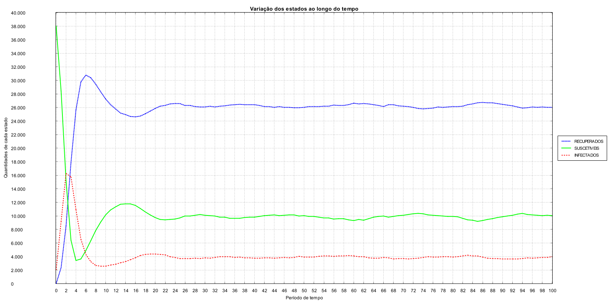

# Sobre o Projeto

- Projeto desenvolvido em grupo na matéria de estrutura de dados ministrada pelo professor Gustavo Fortunato Puga. 
- O projeto tem como objetivo simular o modelo SIR (Suscetível, Infectado e Recuperado) através do autómato celular e da aplicação da regra solicitada, identificando através das gerações a variação da quantidade de cada um dos estados.
- Foram utilizadas algumas estruturas de dados da biblioteca do Java, tal como a criação de um grafo para representar os estados (vértices) e suas conexões (arestas) com outros estados (vértices).

# Resultados Obtidos

- População: 40000
- Estados: Suscetível, Infectado e Recuperado
- Probabilidades 
  - Suscetível
    * Infectado => 1 - e^k onde K é a quantidade de vizinhos da Pessoa
    * Recuperado => 0.3 
  - Recuperado
    * Suscetível => 0.1
  - Infectado
    * Suscetível => 0.01
    * Recuperado => 0.6
- Geral:
  - S = {R, I}
  - I = {R, S}
  - R = {S}
- Gráfico Obtido com as especificações acima:

  

  

# Colaboradores

- Henrriky Jhonny
- Alyson Fumagalli
- Henrique Santiago
- Eliel Silva
- Bruno Fischer